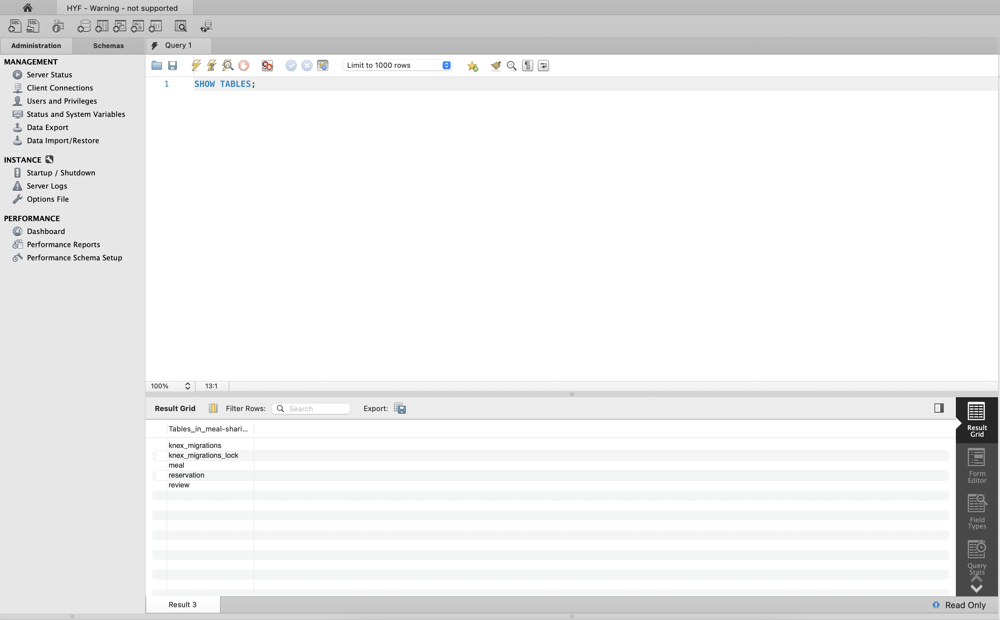
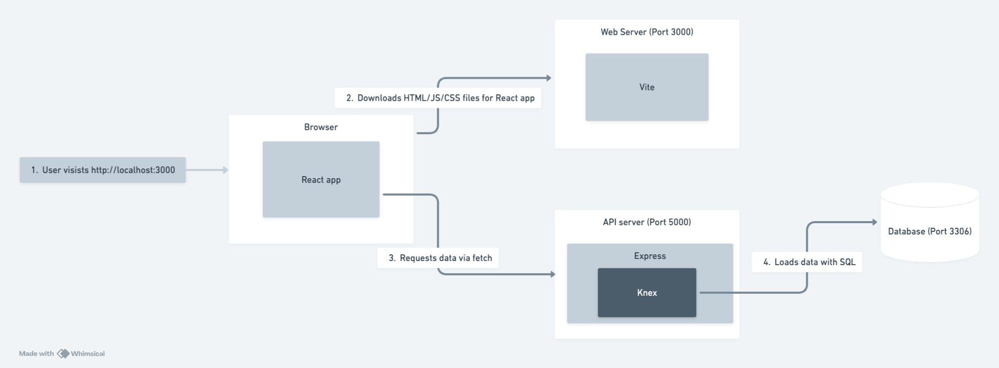

# HackYourFuture project template

This template is meant to be used as part of the meal-sharing and Final Project modules,
but can work as a starting point for any full stack project.

It consists of two packages:

- `api` which is a NodeJS project using Express for the API
- `app` which is Next project using React for the web app

Both packages are as small as possible but feel free to add more tools as you see fit.

## Prerequisites

This template assumes that there is a database already set up with tables and data.

You can start a MySQL instance using Docker with the below command:  
`docker run --name mysql -e MYSQL_ROOT_PASSWORD=mysql-root-password -e MYSQL_DATABASE=my-database -d -p 3306:3306 mysql:latest`

Then connect to this instance using any database management tool you prefer, such as MySQL Workbench, to set up your tables and add data.


## Getting started

> Before you start, make sure no other projects are running, in order to have the ports free.

To get started you'll need two terminals.

In the first terminal run the following commands:

```
cd api
cp .env-example .env
npm install
npm run dev
```

You can then test the API using [Postman](https://www.postman.com/) at [http://localhost:3001/api](http://localhost:3001/api).


In the second terminal run the following commands:

```
cd app
npm install
npm run dev
```

You can then open the web app at [http://localhost:3000](http://localhost:3000).


## Common issues

### Port conflict

If you see the below error when trying to start either the API or the web app, then you have a port conflict.  
Some other process is already listening on the port you want to use. Either stop that process or use another port by changing the PORT variable in the `.env` file for the package that is facing the conflict (API or web app).

```
node:events:496
      throw er; // Unhandled 'error' event
      ^

Error: listen EADDRINUSE: address already in use :::3001
    at Server.setupListenHandle [as _listen2] (node:net:1897:16)
    at listenInCluster (node:net:1945:12)
    at Server.listen (node:net:2037:7)
    at Function.listen (/Users/hyf/dev/hyf/hyf-project-template/api/node_modules/express/lib/application.js:635:24)
    at file:///Users/hyf/dev/hyf/hyf-project-template/api/src/index.js:29:5
    at ModuleJob.run (node:internal/modules/esm/module_job:222:25)
    at async ModuleLoader.import (node:internal/modules/esm/loader:323:24)
    at async loadESM (node:internal/process/esm_loader:28:7)
    at async handleMainPromise (node:internal/modules/run_main:113:12)
Emitted 'error' event on Server instance at:
    at emitErrorNT (node:net:1924:8)
    at process.processTicksAndRejections (node:internal/process/task_queues:82:21) {
  code: 'EADDRINUSE',
  errno: -48,
  syscall: 'listen',
  address: '::',
  port: 3001
}
```

### Wrong database credentials

If you see the error below when trying to make a query to your database it means that the variables `DB_USER` and `DB_PASSWORD` don't match the username and password used when starting the database container. Either find the right credentials or recreate your database container and store the new credentials.

```
/Users/hyf/dev/hyf/hyf-project-template/api/node_modules/mysql2/lib/packets/packet.js:728
    const err = new Error(message);
                ^

Error: Access denied for user 'root'@'192.168.65.1' (using password: YES)
    at Packet.asError (/Users/hyf/dev/hyf/hyf-project-template/api/node_modules/mysql2/lib/packets/packet.js:728:17)
    at ClientHandshake.execute (/Users/hyf/dev/hyf/hyf-project-template/api/node_modules/mysql2/lib/commands/command.js:29:26)
    at Connection.handlePacket (/Users/hyf/dev/hyf/hyf-project-template/api/node_modules/mysql2/lib/connection.js:481:34)
    at PacketParser.onPacket (/Users/hyf/dev/hyf/hyf-project-template/api/node_modules/mysql2/lib/connection.js:97:12)
    at PacketParser.executeStart (/Users/hyf/dev/hyf/hyf-project-template/api/node_modules/mysql2/lib/packet_parser.js:75:16)
    at Socket.<anonymous> (/Users/hyf/dev/hyf/hyf-project-template/api/node_modules/mysql2/lib/connection.js:104:25)
    at Socket.emit (node:events:519:28)
    at addChunk (node:internal/streams/readable:559:12)
    at readableAddChunkPushByteMode (node:internal/streams/readable:510:3)
    at Readable.push (node:internal/streams/readable:390:5) {
  code: 'ER_ACCESS_DENIED_ERROR',
  errno: 1045,
  sqlState: '28000',
  sqlMessage: "Access denied for user 'root'@'192.168.65.1' (using password: YES)",
  sql: undefined
}
```

### Using SSL when the database does not support it

If you see the below error, then you are trying to establish a SSL (secure) connection to a database that doesn't support it, most likely you set the value of the environment variable `DB_USE_SSL` to "true" when it should be "false".

```
/Users/hyf/dev/hyf/hyf-project-template/api/node_modules/pg/lib/connection.js:77
          return self.emit('error', new Error('The server does not support SSL connections'))
                                    ^

Error: The server does not support SSL connections
    at Socket.<anonymous> (/Users/hyf/dev/hyf/hyf-project-template/api/node_modules/pg/lib/connection.js:77:37)
    at Object.onceWrapper (node:events:633:26)
    at Socket.emit (node:events:518:28)
    at addChunk (node:internal/streams/readable:559:12)
    at readableAddChunkPushByteMode (node:internal/streams/readable:510:3)
    at Readable.push (node:internal/streams/readable:390:5)
    at TCP.onStreamRead (node:internal/stream_base_commons:190:23)

Node.js v20.12.2
[nodemon] app crashed - waiting for file changes before starting...

Database not running or wrong address:
API listening on port 3001
node:internal/process/promises:289
            triggerUncaughtException(err, true /* fromPromise */);
            ^

AggregateError [ECONNREFUSED]:
    at internalConnectMultiple (node:net:1116:18)
    at afterConnectMultiple (node:net:1683:7) {
  code: 'ECONNREFUSED',
  fatal: true,
  [errors]: [
    Error: connect ECONNREFUSED ::1:3306
        at createConnectionError (node:net:1646:14)
        at afterConnectMultiple (node:net:1676:16) {
      errno: -61,
      code: 'ECONNREFUSED',
      syscall: 'connect',
      address: '::1',
      port: 3306
    },
    Error: connect ECONNREFUSED 127.0.0.1:3306
        at createConnectionError (node:net:1646:14)
        at afterConnectMultiple (node:net:1676:16) {
      errno: -61,
      code: 'ECONNREFUSED',
      syscall: 'connect',
      address: '127.0.0.1',
      port: 3306
    }
  ]
}
```

### Broken TypeScript config file
This boilerplate does not use TypeScript, but Next which is used in the `app` package has built in support for TypeScript.
This means that Next (or rather `esbuild` which is used internally) will look for a TypeScript config file (`tsconfig.json`) in the current folder and all parent folders until it finds one.
If it does find a TypeScript config file but that file is invalid or empty you'll see errors like this:

```
✘ [ERROR] Unexpected end of file in JSON

    ../../tsconfig.json:1:0:
      1 │ 
        ╵ ^

failed to load config from /Users/milton/dev/hyf/hyf-project-template/app/next.config.js
error when starting dev server:
Error: Build failed with 1 error:
../../tsconfig.json:1:0: ERROR: Unexpected end of file in JSON
    at failureErrorWithLog (/Users/milton/dev/hyf/hyf-project-template/app/node_modules/esbuild/lib/main.js:1651:15)
    at /Users/milton/dev/hyf/hyf-project-template/app/node_modules/esbuild/lib/main.js:1059:25
    at runOnEndCallbacks (/Users/milton/dev/hyf/hyf-project-template/app/node_modules/esbuild/lib/main.js:1486:45)
    at buildResponseToResult (/Users/milton/dev/hyf/hyf-project-template/app/node_modules/esbuild/lib/main.js:1057:7)
    at /Users/milton/dev/hyf/hyf-project-template/app/node_modules/esbuild/lib/main.js:1086:16
    at responseCallbacks.<computed> (/Users/milton/dev/hyf/hyf-project-template/app/node_modules/esbuild/lib/main.js:704:9)
    at handleIncomingPacket (/Users/milton/dev/hyf/hyf-project-template/app/node_modules/esbuild/lib/main.js:764:9)
    at Socket.readFromStdout (/Users/milton/dev/hyf/hyf-project-template/app/node_modules/esbuild/lib/main.js:680:7)
    at Socket.emit (node:events:519:28)
    at addChunk (node:internal/streams/readable:559:12)
```

There are 3 possible solutions:
1. Delete the offending TypeScript config file
2. Fix the issue in the file so that Next can use it
3. Move your project folder to some place that doesn't put the TypeScript config file in the parent folder of your project folder

## Architecture diagram



## Applying consistent formatting

Before you commit any changes you've made, you can run the command `npm run format` in either package to format the code using [Prettier](https://prettier.io/).

Using a consistent code style makes it easier to read code which improves productivity and avoid bugs.  
When collaborating with other people, a code base should still look like it was written by a single person.

## Checking for common code problems

Before you commit your changes, you can use `npm run check` in either package to check for code issues using [ESLint](https://eslint.org/).

ESLint is a "linter", a tool that scans your code for common code problems, this can help you avoid bugs and write better code.

## Deploying

All 3 components (database, API, web app) can be deployed for free at [Render.com](https://render.com).
Sign in using your Github account to make the process smoother.
When you sign in you can specify which of your repositories you want Render.com to have access to.

[Database and API deployment instructions](./api/README.md#deploying)  
[App deployment instructions](./app/README.md#deploying-a-static-web-app)
